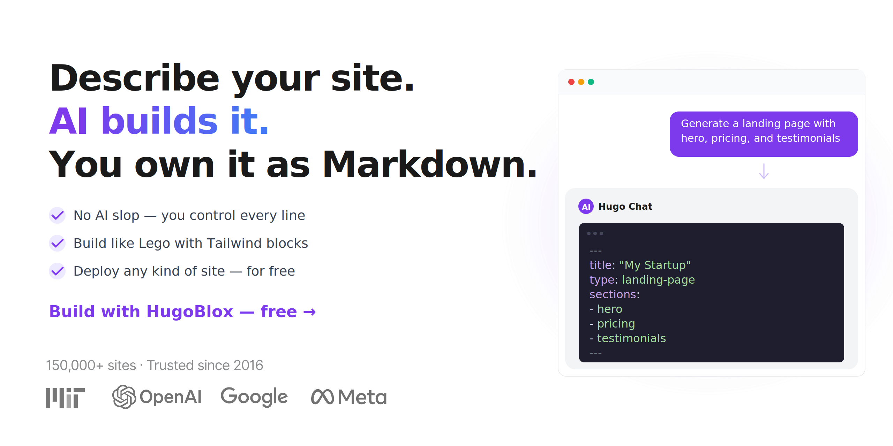

[**中文**](./README.zh.md)

<p align="center">
  <a href="https://hugoblox.com/templates/?utm_source=github&utm_medium=readme&utm_content=hero">
    
  </a>
</p>

<h1 align="center">Describe your site. AI builds it. You own it as Markdown.</h1>

<p align="center">
  <strong>HugoBlox is the open-source framework for building professional sites from structured Markdown — landing pages, portfolios, blogs, publications, docs, and more.</strong><br/>
  Pick a template, let <a href="https://hugo.chat/?utm_source=github&utm_medium=readme&utm_content=tagline">Hugo Chat AI</a> generate your pages, and deploy anywhere. Every file is plain Markdown you can read, edit, and own forever.
</p>

<p align="center">
  <a href="https://hugo.chat/?utm_source=github&utm_medium=readme&utm_content=cta_top"><b>Generate Pages with AI</b></a>
  &nbsp;&nbsp;|&nbsp;&nbsp;
  <a href="https://hugoblox.com/templates/?utm_source=github&utm_medium=readme&utm_content=cta_top"><b>Browse Templates</b></a>
  &nbsp;&nbsp;|&nbsp;&nbsp;
  <a href="https://marketplace.visualstudio.com/items?itemName=ownable.ownable"><b>Ownable CMS for VS Code</b></a>
</p>

<div align="center">

  <a href="https://github.com/HugoBlox/kit">
    
  </a>
  <a href="https://discord.gg/z8wNYzb">
    
  </a>
  <a href="https://marketplace.visualstudio.com/items?itemName=ownable.ownable">
    
  </a>
  <a href="https://open-vsx.org/extension/Ownable/ownable">
    
  </a>
  <a href="https://x.com/MakeOwnable">
    
  </a>

</div>

<p align="center">
  <sub>
    Trusted since <strong>2016</strong> · <strong>150,000+</strong> sites (Meta, Stanford, NVIDIA) · Rated <strong>4.9/5</strong> by users (official survey) · Used by teams at <a href="https://research.nvidia.com/research-labs">NVIDIA Research</a>, <a href="https://www.metaconscious.org/">MIT</a>, and <a href="https://cai4cai.ml/">King's College London</a> · Featured by <a href="https://github.blog/open-source/release-radar-february-2019/#hugo-academic-4-0">GitHub Release Radar</a>
  </sub>
</p>

<!-- TODO: Replace with demo video -->
<!-- https://github.com/user-attachments/assets/REPLACE_ME -->

---

## ⚡ How it works

<table>
<tr>
<td width="33%" align="center">

**1. 🎨 Pick a template**

Choose a [template](https://hugoblox.com/templates/?utm_source=github&utm_medium=readme&utm_content=how_it_works) or scaffold with the CLI.

Landing pages, portfolios, blogs, research sites, docs — ready in seconds.

</td>
<td width="33%" align="center">

**2. ✨ Generate pages with AI**

Open [Hugo Chat](https://hugo.chat/?utm_source=github&utm_medium=readme&utm_content=how_it_works) and describe what you need.

*"Create a landing page with hero, pricing, and testimonials"* — done.

</td>
<td width="33%" align="center">

**3. 🚀 Deploy anywhere**

Push to GitHub. Deploy on Netlify, Vercel, Cloudflare — or any static host.

No database. No runtime. Free hosting.

</td>
</tr>
</table>

---

## 🏆 Why HugoBlox

Every other tool makes you choose. HugoBlox doesn't.

| | **AI site builders** (Lovable, v0, Bolt) | **CMS platforms** (WordPress, Webflow) | **HugoBlox** |
| :--- | :---: | :---: | :---: |
| AI generates your pages | Yes | No | **Yes** |
| You own the output as readable files | No — React code | No — locked in a database | **Yes — plain Markdown** |
| Works without a runtime server | Sometimes | No | **Yes — static HTML** |
| Structured content types (publications, projects, team pages) | No | Partial | **Yes — 20+ built-in types** |
| Human-editable after AI generates it | Barely | Through the CMS only | **Yes — it's Markdown** |
| Free to host forever | No | No | **Yes** |
| Open source | No | No | **Yes — MIT licensed** |

> [!IMPORTANT]
> **The pitch:** other tools generate code you can't maintain or lock your content in a database you can't leave. HugoBlox gives you AI-generated pages as plain Markdown on a Tailwind + Hugo stack — readable, portable, and yours.

---

## 🧱 What you can build

<p align="center">
  
</p>

HugoBlox includes **20+ structured content types** with proper front matter, metadata, and layouts. Tell Hugo Chat what you need and it generates the right one:

- 🚀 **Landing pages** — hero, features, pricing, testimonials, CTA sections via the block system
- 📝 **Blogs & articles** — posts with tags, categories, authors, and SEO metadata
- 💼 **Portfolios & project pages** — showcase your work with descriptions, tech stacks, and images
- 📚 **Publication pages** — academic papers with BibTeX/DOI citation workflows
- 📖 **Documentation** — searchable docs with sidebar navigation and versioning
- 👥 **Team & author profiles** — bio, avatar, social links, publication lists
- 🎤 **Event & talk pages** — conferences, workshops, presentations with slides
- 🎞️ **Slide decks** — Markdown-powered presentations using reveal.js
- 📄 **Resumes & CVs** — structured career pages, exportable to PDF
- 🔬 **Jupyter notebooks & LaTeX** — render `.ipynb` and math-heavy pages natively

<p align="center">
  <a href="https://hugoblox.com/templates/?utm_source=github&utm_medium=readme&utm_content=cta_templates"><b>Browse all templates</b></a>
</p>

---

## 🛠️ Get started

### Step 1: Create your site

**Option A: Start from a template** (fastest)

> [!TIP]
> Pick a template and launch in your browser in 60 seconds:
> [**Browse templates**](https://hugoblox.com/templates/?utm_source=github&utm_medium=readme&utm_content=get_started)

**Option B: Use the CLI** (full control)

```bash
# Requires Hugo Extended & Node.js
npm install -g hugoblox
hugoblox create site
```

### Step 2: Customize with AI + visual editing

<table>
<tr>
<td width="50%">

**Hugo Chat** — AI page generation

Describe what you need in plain English. Hugo Chat generates structured Hugo pages with correct front matter, shortcodes, and HugoBlox blocks.

> *"Generate a landing page for my consulting firm with services, testimonials, and a contact form"*

[**Try Hugo Chat — free**](https://hugo.chat/?utm_source=github&utm_medium=readme&utm_content=step2)

</td>
<td width="50%">

**Ownable CMS** — visual editing in VS Code

Drag-and-drop blocks, live preview, and YAML validation without leaving your editor. The power of a visual website builder inside VS Code.

1. Install [Ownable CMS](https://marketplace.visualstudio.com/items?itemName=ownable.ownable) from the Marketplace
2. Open your HugoBlox project
3. Click the Ownable icon to start editing

</td>
</tr>
</table>

<p align="center">
  
</p>

> [!NOTE]
> **Need docs?** See [**docs.hugoblox.com**](https://docs.hugoblox.com/?utm_source=github&utm_medium=readme&utm_content=docs) for guides, configuration reference, and best practices.

---

## 🔓 Open source. No lock-in. No catch.

- ✅ **MIT licensed.** The framework is and will always be open source.
- ✅ **Plain Markdown files.** Your content is never locked in a database or proprietary format. Take it anywhere.
- ✅ **Static output.** No server to maintain, no database to patch, no vendor to depend on.
- ✅ **Free hosting.** Deploy to Netlify, Vercel, GitHub Pages, Cloudflare Pages — all free tier.
- ✅ **AI is free to start.** Hugo Chat includes free messages every day. No credit card needed.
- ✅ **Future-proof.** Markdown has been readable since 2004. Your content will outlast any platform.

> [!IMPORTANT]
> *"Every AI website builder generates React code you'll throw away in six months. Every CMS locks your content in a database you'll never migrate. HugoBlox is the gap between them."*

**Want more?** Upgrade to [**Pro**](https://hugoblox.com/pricing?utm_source=github&utm_medium=readme&utm_content=plans) for visual editing, AI automations, BibTeX import, and priority support. [Compare plans →](https://hugoblox.com/pricing?utm_source=github&utm_medium=readme&utm_content=plans)

---

## 🌍 Who uses HugoBlox

HugoBlox powers sites for **researchers, consultants, founders, developer advocates, and teams** at organizations including:

- [NVIDIA Research Labs](https://research.nvidia.com/research-labs)
- [MIT MetaConscious Group](https://www.metaconscious.org/)
- [King's College London](https://cai4cai.ml/)
- [Stanford](https://profiles.stanford.edu/), [Google](https://google.com), [Meta](https://meta.com), [OpenAI](https://openai.com)

<sub>150,000+ sites created since 2016. Rated 4.9/5 by users.</sub>

> *"We tried Lovable and v0 first. They generated a landing page in minutes — but it was 400 lines of React we couldn't touch. Hugo Chat generated the same page as Markdown files our whole team could edit. We shipped that afternoon. Hosting: $0/month."*
> — **Priya Ramanathan**, Co-founder & CTO, Arcline Labs

> *"I described our research areas to Hugo Chat and it generated 30 publication pages with correct BibTeX metadata, team profiles, and a news section. My postdocs were editing their own pages within an hour — it's just Markdown. No CMS training, no tickets to IT."*
> — **Dr. James Park**, Principal Research Scientist, Applied AI Lab

> *"I've rebuilt my site four times — Jekyll, Gatsby, Next.js, Notion. HugoBlox is the first time I know I won't have to again. My content is plain Markdown. If something better exists in five years, I take my files and leave. Nothing has come close."*
> — **Marcus Oliveira**, Senior Developer Advocate

---

<h2 align="center">🚀 Ready to build?</h2>

<p align="center">
  Pick a template, let AI generate your pages, and deploy for free.<br/>
  Your content stays as Markdown you own forever.
</p>

<p align="center">
  <a href="https://hugo.chat/?utm_source=github&utm_medium=readme&utm_content=cta_final"><b>Generate Pages with AI</b></a>
  &nbsp;&nbsp;|&nbsp;&nbsp;
  <a href="https://hugoblox.com/templates/?utm_source=github&utm_medium=readme&utm_content=cta_final"><b>Browse Templates</b></a>
  &nbsp;&nbsp;|&nbsp;&nbsp;
  <a href="https://docs.hugoblox.com/?utm_source=github&utm_medium=readme&utm_content=cta_final"><b>Read the Docs</b></a>
</p>

---

## Community & support

- **Questions?** Join the [Discord](https://discord.gg/z8wNYzb) or search the [Docs](https://docs.hugoblox.com/)
- **Bug?** Open an [Issue](https://github.com/HugoBlox/kit/issues)
- **Want to contribute?** Read the [Contributing Guide](./CONTRIBUTING.md)
- **Love it?** [Star this repo](https://github.com/HugoBlox/kit) — it helps others find it

### Sponsors

[**❤️ Sponsor on GitHub**](https://github.com/sponsors/gcushen) | [**🏢 Become a Partner**](https://github.com/sponsors/gcushen)

---

## License

Copyright 2016-present [**Lore Labs**](https://lore.tech/?utm_source=github&utm_medium=readme).
Released under the [MIT License](./LICENSE.md).

<p align="center">
  <sub>HugoBlox is a trademark of Lore Labs.</sub>
</p>
