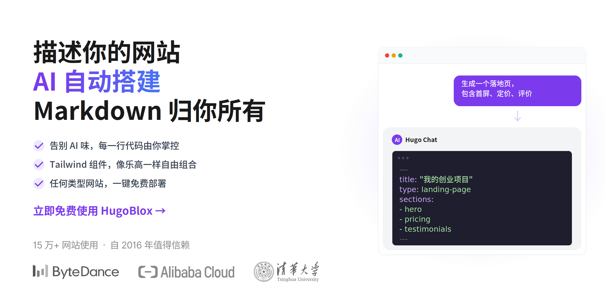

[**English**](./README.md)

<p align="center">
  <a href="https://hugoblox.com/templates/?utm_source=github&utm_medium=readme&utm_content=hero">
    
  </a>
</p>

<h1 align="center">描述你的站点，AI 帮你搭建，Markdown 永远归你。</h1>

<p align="center">
  <strong>HugoBlox 是基于结构化 Markdown 构建专业站点的开源框架 —— 落地页、作品集、博客、学术主页、文档等，一应俱全。</strong><br/>
  选择模板，用 <a href="https://hugo.chat/?utm_source=github&utm_medium=readme&utm_content=tagline">Hugo Chat AI</a> 生成页面，部署到任何平台。每个文件都是你能阅读、编辑、永久拥有的纯 Markdown。
</p>

<p align="center">
  <a href="https://hugo.chat/?utm_source=github&utm_medium=readme&utm_content=cta_top"><b>用 AI 生成页面</b></a>
  &nbsp;&nbsp;|&nbsp;&nbsp;
  <a href="https://hugoblox.com/templates/?utm_source=github&utm_medium=readme&utm_content=cta_top"><b>浏览模板</b></a>
  &nbsp;&nbsp;|&nbsp;&nbsp;
  <a href="https://marketplace.visualstudio.com/items?itemName=ownable.ownable"><b>Ownable CMS (VS Code)</b></a>
</p>

<div align="center">

  <a href="https://github.com/HugoBlox/kit">
    
  </a>
  <a href="https://discord.gg/z8wNYzb">
    
  </a>
  <a href="https://marketplace.visualstudio.com/items?itemName=ownable.ownable">
    
  </a>
  <a href="https://open-vsx.org/extension/Ownable/ownable">
    
  </a>
  <a href="https://x.com/MakeOwnable">
    
  </a>

</div>

<p align="center">
  <sub>
    始于 <strong>2016</strong> · 全球 <strong>150,000+</strong> 站点 (Meta, Stanford, NVIDIA) · 用户评分 <strong>4.9/5</strong>（官方调研）· <a href="https://research.nvidia.com/research-labs">NVIDIA Research</a>、<a href="https://www.metaconscious.org/">MIT</a>、<a href="https://cai4cai.ml/">King's College London</a> 等团队在用 · 入选 <a href="https://github.blog/open-source/release-radar-february-2019/#hugo-academic-4-0">GitHub Release Radar</a>
  </sub>
</p>

<!-- TODO: Replace with demo video -->
<!-- https://github.com/user-attachments/assets/REPLACE_ME -->

---

## ⚡ 三步上线

<table>
<tr>
<td width="33%" align="center">

**1. 🎨 选一个模板**

从[模板库](https://hugoblox.com/templates/?utm_source=github&utm_medium=readme&utm_content=how_it_works)中挑选，或用 CLI 脚手架。

落地页、作品集、博客、科研站、文档 —— 秒级就绪。

</td>
<td width="33%" align="center">

**2. ✨ 用 AI 生成页面**

打开 [Hugo Chat](https://hugo.chat/?utm_source=github&utm_medium=readme&utm_content=how_it_works)，用自然语言描述你要什么。

*"帮我生成一个带首屏、定价和用户评价的落地页"* —— 搞定。

</td>
<td width="33%" align="center">

**3. 🚀 部署到任何平台**

推送到 GitHub，部署到 Netlify、Vercel、Cloudflare 或任何静态托管。

无数据库，无运行时，免费托管。

</td>
</tr>
</table>

---

## 🏆 为什么选 HugoBlox

其他工具让你做选择题，HugoBlox 全都要。

| | **AI 建站工具** (Lovable, v0, Bolt) | **传统 CMS** (WordPress, Webflow) | **HugoBlox** |
| :--- | :---: | :---: | :---: |
| AI 生成页面 | 能 | 不能 | **能** |
| 输出是你能看懂的文件 | 不能 —— React 代码 | 不能 —— 锁在数据库里 | **能 —— 纯 Markdown** |
| 无需后端服务器 | 有时 | 不行 | **纯静态 HTML** |
| 结构化内容类型（论文、项目、团队页） | 没有 | 部分 | **20+ 种内置类型** |
| AI 生成后人类还能轻松编辑 | 勉强 | 只能通过 CMS | **当然 —— 就是 Markdown** |
| 永久免费托管 | 不能 | 不能 | **能** |
| 开源 | 不是 | 不是 | **MIT 协议** |

> [!IMPORTANT]
> **一句话总结：** 别的工具要么生成你维护不了的代码，要么把内容锁进你迁不走的数据库。HugoBlox 让 AI 帮你生成页面，输出是 Tailwind + Hugo 技术栈上的纯 Markdown —— 可读、可迁移、永远属于你。

---

## 🧱 你能构建什么

<p align="center">
  
</p>

HugoBlox 内置 **20+ 种结构化内容类型**，带完整的 Front Matter、元数据和布局。告诉 Hugo Chat 你需要什么，它会生成对应的页面：

- 🚀 **落地页** —— 首屏、功能区、定价表、用户评价、CTA 模块，积木式自由组合
- 📝 **博客与文章** —— 标签、分类、作者、SEO 元数据一步到位
- 💼 **作品集与项目页** —— 展示你的工作成果、技术栈和配图
- 📚 **论文页** —— 学术论文 + BibTeX/DOI 引用工作流
- 📖 **文档站** —— 带侧边栏导航和版本控制的可搜索文档
- 👥 **团队与个人简介** —— 头像、社交链接、发表论文列表
- 🎤 **活动与演讲** —— 会议、研讨会、演示幻灯片
- 🎞️ **演示幻灯片** —— 基于 Markdown 的 reveal.js 幻灯片
- 📄 **简历 / CV** —— 结构化职业页面，可导出 PDF
- 🔬 **Jupyter 笔记本 & LaTeX** —— 原生渲染 `.ipynb` 和数学公式页面

<p align="center">
  <a href="https://hugoblox.com/templates/?utm_source=github&utm_medium=readme&utm_content=cta_templates"><b>浏览全部模板</b></a>
</p>

---

## 🛠️ 快速开始

### 第一步：创建站点

**方式 A：从模板开始**（最快）

> [!TIP]
> 选一个模板，60 秒内在浏览器中启动：
> [**浏览模板**](https://hugoblox.com/templates/?utm_source=github&utm_medium=readme&utm_content=get_started)

**方式 B：使用 CLI**（完全掌控）

```bash
# 需要 Hugo Extended 和 Node.js
npm install -g hugoblox
hugoblox create site
```

### 第二步：用 AI + 可视化编辑器定制

<table>
<tr>
<td width="50%">

**Hugo Chat** —— AI 页面生成

用自然语言描述你的需求，Hugo Chat 会生成带正确 Front Matter、Shortcode 和 HugoBlox 积木的 Hugo 页面。

> *"帮我生成一个咨询公司的落地页，包含服务介绍、客户评价和联系表单"*

[**免费试用 Hugo Chat**](https://hugo.chat/?utm_source=github&utm_medium=readme&utm_content=step2)

</td>
<td width="50%">

**Ownable CMS** —— VS Code 里的可视化编辑

拖拽积木、实时预览、YAML 校验，全部在编辑器内完成。把 VS Code 变成可视化建站工具。

1. 从 [VS Code 市场](https://marketplace.visualstudio.com/items?itemName=ownable.ownable) 安装 Ownable CMS
2. 打开你的 HugoBlox 项目
3. 点击 Ownable 图标开始编辑

</td>
</tr>
</table>

<p align="center">
  
</p>

> [!NOTE]
> **需要文档？** 查看 [**docs.hugoblox.com**](https://docs.hugoblox.com/?utm_source=github&utm_medium=readme&utm_content=docs)，获取指南、配置参考和最佳实践。

---

## 🔓 开源、无锁定、没有套路

- ✅ **MIT 协议。** 框架现在是开源的，未来也永远是。
- ✅ **纯 Markdown 文件。** 你的内容不会被锁在数据库或私有格式里，随时可以带走。
- ✅ **纯静态输出。** 不用维护服务器，不用给数据库打补丁，不依赖任何厂商。
- ✅ **免费托管。** 部署到 Netlify、Vercel、GitHub Pages、Cloudflare Pages —— 全部有免费额度。
- ✅ **AI 免费起步。** Hugo Chat 每天赠送免费消息，无需绑定信用卡。
- ✅ **面向未来。** Markdown 从 2004 年开始就能被任何编辑器打开。你的内容会比任何平台活得更久。

> [!IMPORTANT]
> *"所有 AI 建站工具生成的 React 代码，半年后你就想扔掉。所有 CMS 把内容锁在你永远迁不走的数据库里。HugoBlox 填的就是这个空白。"*

**想要更多？** 升级到 [**Pro**](https://hugoblox.com/pricing?utm_source=github&utm_medium=readme&utm_content=plans) 解锁可视化编辑、AI 自动化、BibTeX 导入和优先支持。[对比所有计划 →](https://hugoblox.com/pricing?utm_source=github&utm_medium=readme&utm_content=plans)

---

## 🌍 谁在用 HugoBlox

HugoBlox 为全球的**研究人员、咨询顾问、创业者、技术布道者和团队**提供站点支持，包括：

- [NVIDIA Research Labs](https://research.nvidia.com/research-labs)
- [MIT MetaConscious Group](https://www.metaconscious.org/)
- [King's College London](https://cai4cai.ml/)
- [Stanford](https://profiles.stanford.edu/)、[Google](https://google.com)、[Meta](https://meta.com)、[OpenAI](https://openai.com)

<sub>自 2016 年以来，已创建 150,000+ 站点。用户评分 4.9/5。</sub>

> *"我们先试了 Lovable 和 v0。它们几分钟就生成了落地页 —— 但输出是 400 行看不懂的 React。Hugo Chat 生成的是 Markdown 文件，整个团队都能直接改。当天下午就上线了。托管费：0 元。"*
> — **Priya Ramanathan**, 联合创始人 & CTO, Arcline Labs

> *"我把实验室的研究方向告诉 Hugo Chat，它生成了 30 篇论文页面，BibTeX 元数据全对，还有团队介绍和新闻版块。博士后们一小时内就在编辑自己的页面了 —— 因为就是 Markdown，不需要任何培训。"*
> — **Dr. James Park**, 首席研究科学家, 应用 AI 实验室

> *"我的站点重建过四次 —— Jekyll、Gatsby、Next.js、Notion。HugoBlox 是我第一次确信不用再折腾了。我的内容就是纯 Markdown，如果五年后出现更好的方案，我带着文件就走。但到目前为止，还没有更好的。"*
> — **Marcus Oliveira**, 高级技术布道者

---

<h2 align="center">🚀 准备好开始了吗？</h2>

<p align="center">
  选个模板，让 AI 生成页面，免费部署。<br/>
  你的内容永远以 Markdown 形式属于你自己。
</p>

<p align="center">
  <a href="https://hugo.chat/?utm_source=github&utm_medium=readme&utm_content=cta_final"><b>用 AI 生成页面</b></a>
  &nbsp;&nbsp;|&nbsp;&nbsp;
  <a href="https://hugoblox.com/templates/?utm_source=github&utm_medium=readme&utm_content=cta_final"><b>浏览模板</b></a>
  &nbsp;&nbsp;|&nbsp;&nbsp;
  <a href="https://docs.hugoblox.com/?utm_source=github&utm_medium=readme&utm_content=cta_final"><b>阅读文档</b></a>
</p>

---

## 社区与支持

- **有问题？** 加入 [Discord](https://discord.gg/z8wNYzb) 或搜索[文档](https://docs.hugoblox.com/)
- **发现 Bug？** 提交 [Issue](https://github.com/HugoBlox/kit/issues)
- **想贡献代码？** 阅读[贡献指南](./CONTRIBUTING.md)
- **觉得好用？** 给这个仓库 [点个 Star](https://github.com/HugoBlox/kit) —— 帮助更多人发现它

### 赞助

[**❤️ 在 GitHub 上赞助**](https://github.com/sponsors/gcushen) | [**🏢 成为合作伙伴**](https://github.com/sponsors/gcushen)

---

## 许可证

Copyright 2016-present [**Lore Labs**](https://lore.tech/?utm_source=github&utm_medium=readme).
Released under the [MIT License](./LICENSE.md).

<p align="center">
  <sub>HugoBlox 是 Lore Labs 的商标。</sub>
</p>
